# Utility Class Generation System

Comprehensive documentation for the utility class generation system with controller pattern architecture.

## Table of Contents

- [Overview](#overview)
- [Architecture](#architecture)
- [Core Functions](#core-functions)
- [Core Mixins](#core-mixins)
- [Workflows](#workflows)
- [Configuration Examples](#configuration-examples)

---

## Overview

This system generates utility classes using a **controller pattern** where:
- **Functions** handle all logic and computation
- **Mixins** orchestrate and output CSS
- **Configuration maps** define what classes to generate

### Key Features

✅ Position-based utilities (margin, padding, border)  
✅ Responsive variants (sm:, md:, lg:, xl:, xxl:)  
✅ State variants (hover:, focus:, active:)  
✅ Child combinator support (space-x, space-y)  
✅ Automatic unit handling  
✅ Class name sanitization  
✅ Axis key omission for cleaner names  

---

## Architecture

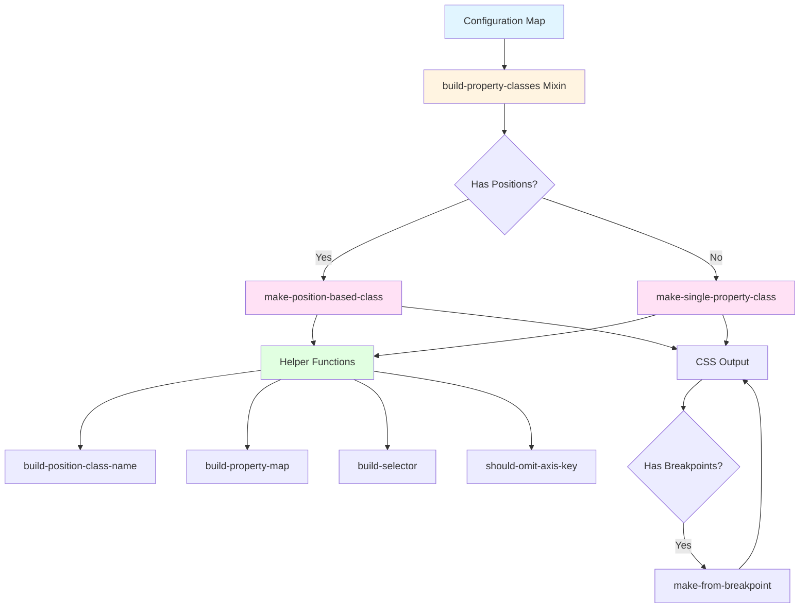

### Controller Pattern

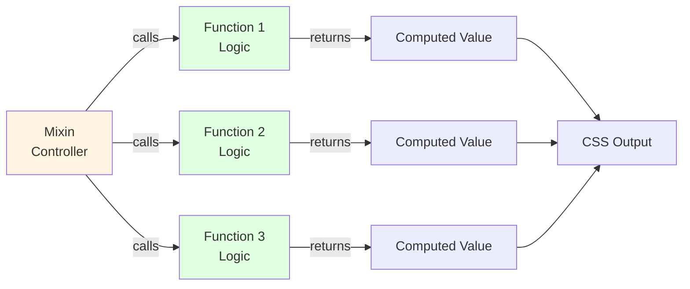

**Benefits:**
- Mixins are thin orchestrators (~10-15 lines)
- Functions are testable and reusable
- Clear separation of concerns
- Easy to extend and maintain

---

## Core Functions

All functions are in `src/functions/_classes.scss`

### `sanitize-class-name($input)`

Converts values into safe CSS class names.

**Purpose:** Clean and escape values for use in class names  
**Returns:** String (sanitized class name)

```scss
// Examples
sanitize-class-name(0.5)   // → '05'
sanitize-class-name(20.5)  // → '20\.5'
sanitize-class-name(1rem)  // → '1'
```

**Process:**
1. Removes `0.` prefix → `0.5` becomes `05`
2. Escapes decimals → `20.5` becomes `20\.5`
3. Removes `rem` units

---

### `strip-class-suffixes($class, $identifier)`

Removes unwanted suffixes from generated class names.

**Purpose:** Clean up internal markers used for logic  
**Returns:** String (cleaned class name)

```scss
// Examples
strip-class-suffixes('m-xy-base')     // → 'm-xy'
strip-class-suffixes('bdr-default')   // → 'bdr'
strip-class-suffixes('bdr-xy', 'bdr-')  // → 'bdr' (xy omitted)
```

**Removes:**
- `-base` suffix
- `-default` suffix
- `-xy` suffix (for specific prefixes like `bdr-`)

---

### `normalise-variant-value($key, $value)`

Normalizes key-value pairs for consistent class generation.

**Purpose:** Handle different input formats uniformly  
**Returns:** List `($variant, $value)`

```scss
// Examples
normalise-variant-value(1, null)        // → ('1', 1)
normalise-variant-value('sm', 1)        // → ('sm', 1)
normalise-variant-value((sm, 1), null)  // → ('sm', 1)
```

**Process:**
1. Sanitizes the key for class names
2. Uses key as value if no value provided
3. Handles list format `[variant, value]`

---

### `should-omit-axis-key($position-key, $omit-axis-keys)`

Determines if a position key should be excluded from class names.

**Purpose:** Enable cleaner class names like `m-1` instead of `m-xy-1`  
**Returns:** Boolean

```scss
// Examples
should-omit-axis-key('xy', ('xy'))  // → true
should-omit-axis-key('x', ('xy'))   // → false
should-omit-axis-key('x', null)     // → false
```

**Logic:**
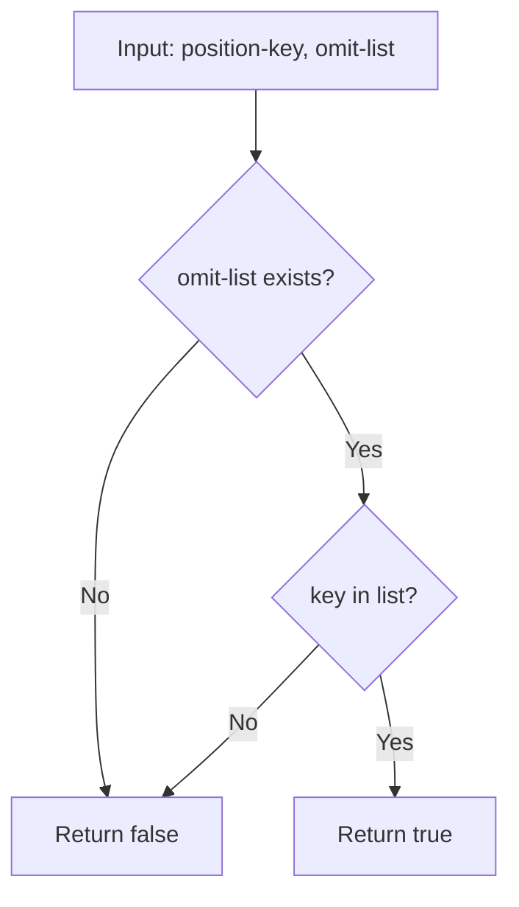

---

### `build-position-class-name($identifier, $variant, $position-key, $omit-axis-keys)`

Generates the final class name for position-based utilities.

**Purpose:** Combine parts and apply omission rules  
**Returns:** String (final class name)

```scss
// Examples
build-position-class-name('m-', '1', 'x', null)      // → 'm-x-1'
build-position-class-name('m-', '1', 'xy', ('xy'))   // → 'm-1'
build-position-class-name('p-', '2', 'y', null)      // → 'p-y-2'
```

**Process:**
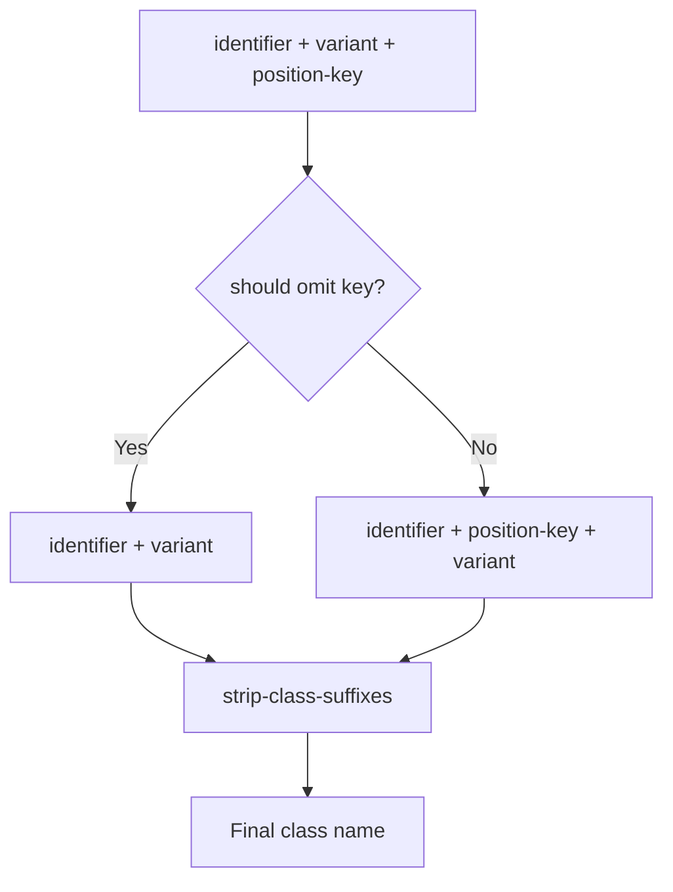

---

### `build-property-map($property, $positions, $value, $get-property-fn)`

Builds a map of CSS properties from position list.

**Purpose:** Convert positions to CSS property-value pairs  
**Returns:** Map of CSS properties

```scss
// Example
$props: build-property-map(
    'margin', 
    (top, bottom), 
    '1rem',
    meta.get-function('get-position-property')
);
// Result: (margin-top: 1rem, margin-bottom: 1rem)
```

**Process:**
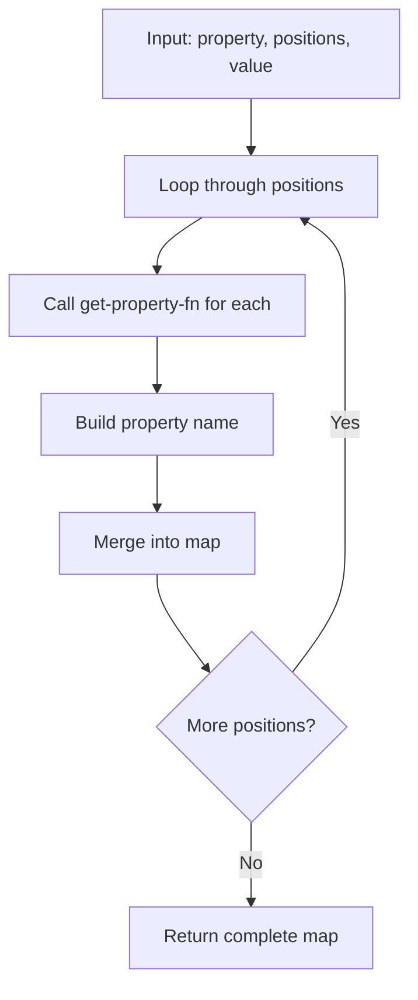

---

### `build-selector($class-name, $child-combinator)` ⭐

Builds CSS selector with optional child combinator support.

**Purpose:** Enable space-x/space-y style utilities  
**Returns:** String (CSS selector)

```scss
// Examples
build-selector('m-x-1', false)  
// → '.m-x-1'

build-selector('space-x-1', true)  
// → ':where(.space-x-1 > *:not(:first-child))'

build-selector('space-y-2', '> * + *')  
// → ':where(.space-y-2 > * + *)'
```

**Options:**
| Parameter         | Result                                     |
| ----------------- | ------------------------------------------ |
| `false` or `null` | Standard selector `.class`                 |
| `true`            | Default combinator `> *:not(:first-child)` |
| String            | Custom combinator pattern                  |

**Logic:**
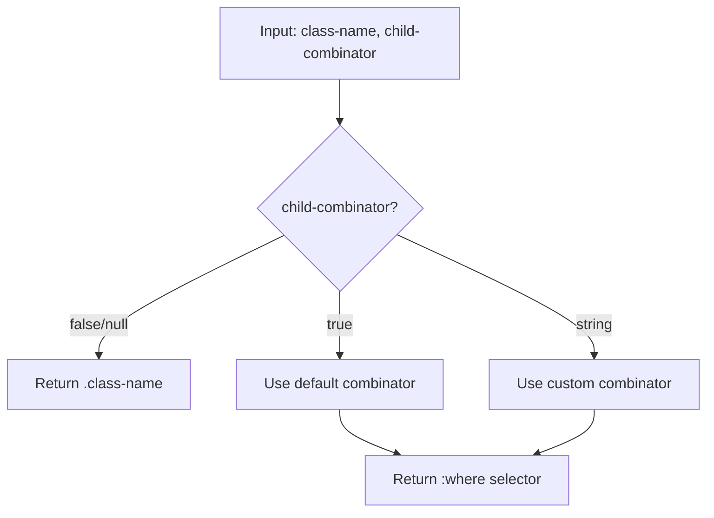

---

## Core Mixins

All mixins are in `src/mixins/_make-classes.scss` and `src/mixins/_build-classes.scss`

### `build-property-classes($properties-map, $responsive, $with-state)`

**Main controller mixin** that generates utility classes from a configuration map.

**Purpose:** Process configuration and generate all utility classes  
**Parameters:**
- `$properties-map` - Configuration map
- `$responsive` - Enable responsive variants (default: `true`)
- `$with-state` - Enable state variants (default: `false`)

**Workflow:**
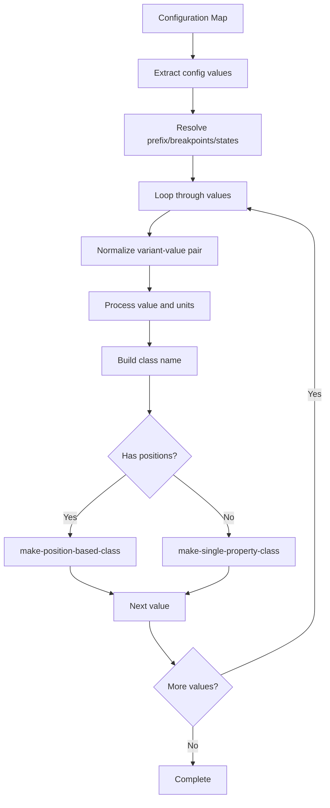

**Configuration Structure:**
```scss
$properties-map: (
    property-name: (
        prefix: 'prefix-',           // Optional custom prefix
        values: (1, 2, 3),           // Values to generate
        unit: 'rem',                 // Unit for values
        positions: (...),            // Optional position map
        omit-axis-keys: ('xy'),      // Optional keys to omit
        child-combinator: true,      // Optional child combinator
        breakpoints: (sm, md),       // Optional custom breakpoints
        states: (hover, focus)       // Optional states
    )
);
```

---

### `make-position-based-class($property, $value, $positions-map, ...)`

Generates utility classes for properties that apply to multiple positions.

**Purpose:** Create position-aware utilities (m-x-1, p-y-2, etc.)  
**Used for:** margin, padding, border, etc.

**Parameters:**
- `$property` - CSS property name
- `$value` - CSS value to apply
- `$positions-map` - Map of position keys to positions
- `$identifier` - Class prefix
- `$variant` - Class suffix
- `$breakpoints` - Responsive breakpoints
- `$states` - Pseudo-class states
- `$omit-axis-keys` - Keys to omit
- `$child-combinator` - Child combinator flag

**Workflow:**
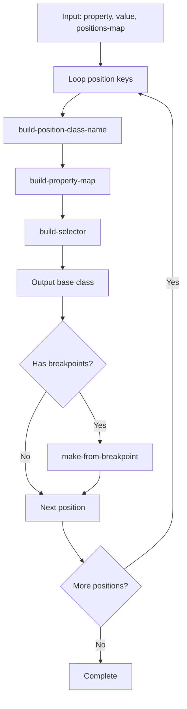

**Example:**
```scss
// Input
make-position-based-class(
    'margin', '1rem', 
    (x: (inline-start, inline-end), y: (block-start, block-end)),
    'm-', '1', (sm, md), (), (), false
);

// Output
.m-x-1 { margin-inline-start: 1rem; margin-inline-end: 1rem; }
.m-y-1 { margin-block-start: 1rem; margin-block-end: 1rem; }
.sm\:m-x-1 { @media... }
.md\:m-x-1 { @media... }
```

---

### `make-single-property-class($property, $class-name, $value, ...)`

Generates a single utility class for one CSS property.

**Purpose:** Create simple utility classes  
**Used for:** display, color, width, etc.

**Parameters:**
- `$property` - CSS property name
- `$class-name` - Class name
- `$value` - CSS value
- `$breakpoints` - Responsive breakpoints
- `$states` - Pseudo-class states
- `$child-combinator` - Child combinator flag

**Workflow:**
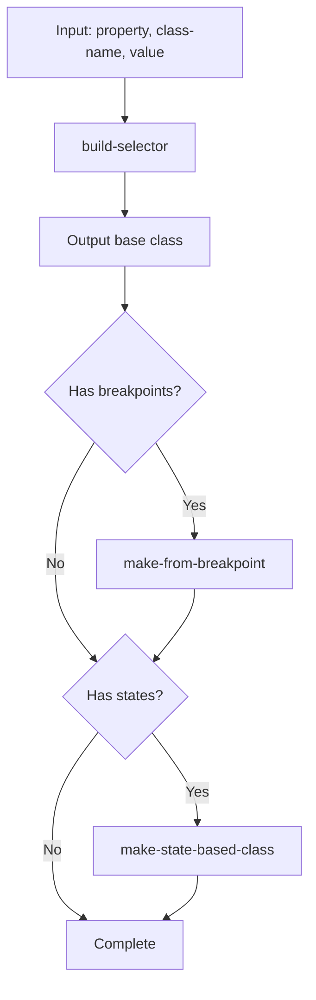

---

### `make-from-breakpoint($props, $identifier, $breakpoints, $child-combinator)`

Generates responsive variants for utility classes.

**Purpose:** Create breakpoint-specific classes  
**Generates:** `sm:class`, `md:class`, `lg:class`, etc.

**Workflow:**
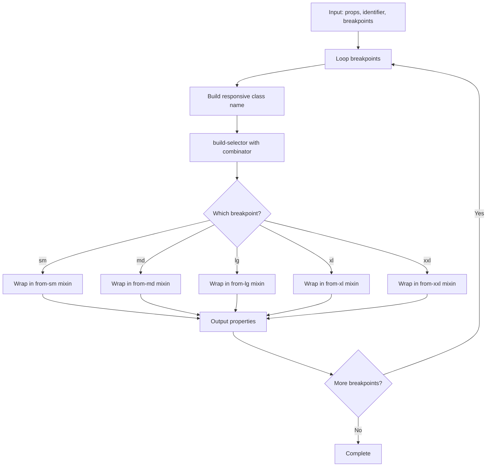

---

## Workflows

### Standard Utility Generation

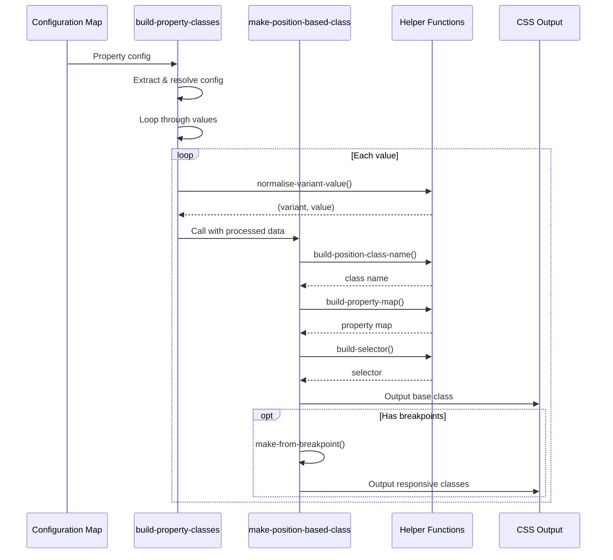

### Child Combinator Flow

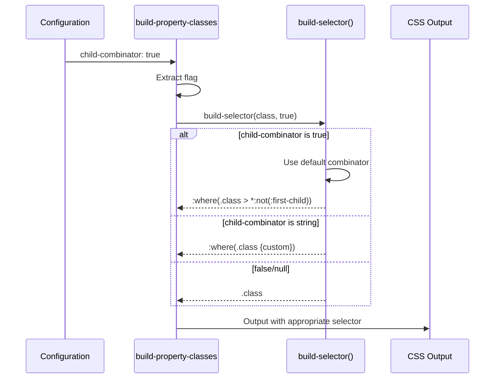

---

## Configuration Examples

### Basic Margin Utilities

```scss
$margin-config: (
    margin: (
        prefix: 'm',
        values: (0, 1, 2, 3, 4),
        unit: 'rem',
        positions: (
            xy: (top, right, bottom, left),
            x: (left, right),
            y: (top, bottom),
            t: (top),
            r: (right),
            b: (bottom),
            l: (left)
        ),
        omit-axis-keys: ('xy')  // Generates .m-1 instead of .m-xy-1
    )
);

@include build-property-classes($margin-config);
```

**Generates:**
```css
.m-1 { margin: 1rem; }
.m-x-1 { margin-left: 1rem; margin-right: 1rem; }
.m-y-1 { margin-top: 1rem; margin-bottom: 1rem; }
.m-t-1 { margin-top: 1rem; }
/* etc... */
```

---

### Child Combinator (Space Utilities)

```scss
$space-config: (
    margin: (
        prefix: 'space',
        values: (1, 2, 3, 4),
        unit: 'rem',
        positions: (
            x: (inline-start),
            y: (block-start)
        ),
        child-combinator: true  // Enable child combinator
    )
);

@include build-property-classes($space-config, $responsive: true);
```

**Generates:**
```css
:where(.space-x-1 > *:not(:first-child)) { 
    margin-inline-start: 1rem; 
}
:where(.space-y-1 > *:not(:first-child)) { 
    margin-block-start: 1rem; 
}

@media (min-width: 640px) {
    :where(.sm\:space-x-1 > *:not(:first-child)) { 
        margin-inline-start: 1rem; 
    }
}
/* etc... */
```

**HTML Usage:**
```html
<div class="space-x-2">
    <button>Button 1</button>
    <button>Button 2</button>  <!-- Gets 2rem margin-left -->
    <button>Button 3</button>  <!-- Gets 2rem margin-left -->
</div>
```

---

### Display Utilities (Single Property)

```scss
$display-config: (
    display: (
        values: (
            block: block,
            inline: inline,
            flex: flex,
            grid: grid,
            none: none
        )
    )
);

@include build-property-classes($display-config);
```

**Generates:**
```css
.block { display: block; }
.inline { display: inline; }
.flex { display: flex; }
.grid { display: grid; }
.none { display: none; }
```

---

### Responsive Width Utilities

```scss
$width-config: (
    width: (
        prefix: 'w',
        values: (
            full: 100%,
            half: 50%,
            auto: auto,
            screen: 100vw
        ),
        breakpoints: (sm, md, lg)
    )
);

@include build-property-classes($width-config, $responsive: true);
```

**Generates:**
```css
.w-full { width: 100%; }
.w-half { width: 50%; }

@media (min-width: 640px) {
    .sm\:w-full { width: 100%; }
}
@media (min-width: 768px) {
    .md\:w-full { width: 100%; }
}
/* etc... */
```

---

### State Variants (Hover, Focus)

```scss
$bg-config: (
    background-color: (
        prefix: 'bg',
        values: (
            primary: #3b82f6,
            secondary: #8b5cf6
        ),
        states: (hover, focus)
    )
);

@include build-property-classes($bg-config, $with-state: true);
```

**Generates:**
```css
.bg-primary { background-color: #3b82f6; }
.hover\:bg-primary:hover { background-color: #3b82f6; }
.focus\:bg-primary:focus { background-color: #3b82f6; }
```

---

## Decision Tree

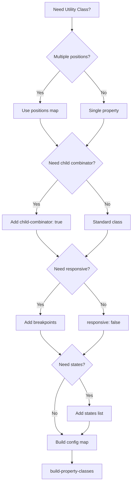

---

## Tips & Best Practices

### 1. Use Controller Pattern
Let functions do the work, mixins just orchestrate.

```scss
// ✅ Good - Thin controller
@mixin my-mixin($value) {
    $processed: process-value($value);  // Function does work
    $selector: build-selector($processed);
    #{$selector} { property: $processed; }
}

// ❌ Bad - Logic in mixin
@mixin my-mixin($value) {
    @if type-of($value) == number {
        @if $value > 0 {
            // ... lots of logic ...
        }
    }
}
```

### 2. Omit Redundant Keys
Use `omit-axis-keys` for cleaner class names.

```scss
// With omit-axis-keys: ('xy')
.m-1    // Clean ✅
.m-x-1
.m-y-1

// Without omission
.m-xy-1  // Redundant ❌
.m-x-1
.m-y-1
```

### 3. Custom Breakpoints
Override default breakpoints per property.

```scss
margin: (
    breakpoints: (sm, md)  // Only these two
)
```

### 4. Child Combinators for Spacing
Use for consistent spacing between elements.

```scss
// Instead of margin on each child
<button class="mr-2">One</button>
<button class="mr-2">Two</button>

// Use parent child combinator
<div class="space-x-2">
    <button>One</button>
    <button>Two</button>
</div>
```

---

## Summary

This system provides a flexible, maintainable way to generate utility classes with:

- **Clean architecture** - Controller pattern separates concerns
- **Reusable functions** - Logic can be tested and composed
- **Flexible configuration** - Control every aspect via maps
- **Minimal mixins** - Thin orchestrators, easy to understand
- **Extensible** - Easy to add new features

The key insight: **Mixins output CSS, functions handle logic**. This makes the system both powerful and maintainable.
