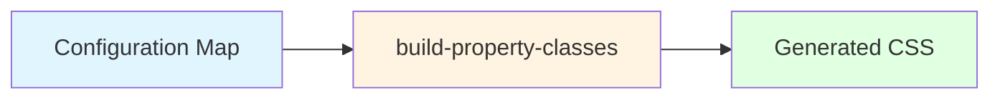
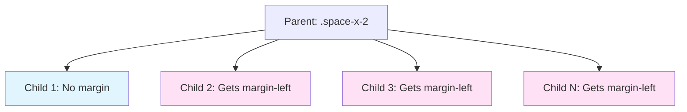

# Utility Class Generation

A practical guide to generating utility classes using the JTB build system.

- [Overview](#overview)
- [Basic Setup](#basic-setup)
- [Creating Utilities](#creating-utilities)
    - [Simple Property Utilities](#simple-property-utilities)
    - [Position-Based Utilities](#position-based-utilities)
    - [Child Combinator Utilities](#child-combinator-utilities)
- [Configuration Options](#configuration-options)
- [Responsive Variants](#responsive-variants)
- [State Variants](#state-variants)
- [Common Patterns](#common-patterns)

## Overview

JTB uses configuration maps to generate utility classes automatically. Define what you want once, and the system generates base classes, responsive variants, and state variants for you.

**The basic flow:**



## Basic Setup

Import the build mixins and define your configuration:

```scss +torchlight-scss
@use 'path/to/mixins/build-classes' as *;

$my-utilities: (
    property-name: (
        // configuration options
    )
);

@include build-property-classes($my-utilities);
```

## Creating Utilities

### Simple Property Utilities

**Goal:** Generate basic utility classes for single properties like display, width, or color.

**Configuration:**

```scss +torchlight-scss
$display-utilities: (
    display: (
        values: (
            block: block,
            flex: flex,
            grid: grid,
            none: none
        )
    )
);

@include build-property-classes($display-utilities);
```

**Generates:**

```css +torchlight-css
.display-block { display: block; }
.display-flex { display: flex; }
.display-grid { display: grid; }
.display-none { display: none; }
```

**Tip:** Use `omit-prefix: true` to generate cleaner class names:

```scss +torchlight-scss
$display-utilities: (
    display: (
        omit-prefix: true,  // Removes 'display-' prefix
        values: (
            block: block,
            flex: flex
        )
    )
);
```

**Generates:**

```css +torchlight-css
.block { display: block; }
.flex { display: flex; }
```

---

### Position-Based Utilities

**Goal:** Generate utilities that apply to multiple positions, like margin or padding (m-1, m-x-2, m-t-3).

**Configuration:**

```scss +torchlight-scss
$margin-utilities: (
    margin: (
        prefix: 'm',
        values: (0, 1, 2, 3, 4),
        unit: 'rem',
        positions: (
            xy: (top, right, bottom, left),
            x: (left, right),
            y: (top, bottom),
            t: (top),
            r: (right),
            b: (bottom),
            l: (left)
        ),
        omit-axis-keys: ('xy')  // Makes .m-1 instead of .m-xy-1
    )
);

@include build-property-classes($margin-utilities);
```

**Generates:**

```css +torchlight-css
.m-1 { margin: 1rem; }
.m-x-1 { margin-left: 1rem; margin-right: 1rem; }
.m-y-1 { margin-top: 1rem; margin-bottom: 1rem; }
.m-t-1 { margin-top: 1rem; }
.m-r-1 { margin-right: 1rem; }
.m-b-1 { margin-bottom: 1rem; }
.m-l-1 { margin-left: 1rem; }
/* Repeats for values 0, 2, 3, 4 */
```

**Using logical properties:**

```scss +torchlight-scss
positions: (
    x: (inline-start, inline-end),
    y: (block-start, block-end)
)
```

This generates classes that adapt to writing direction (RTL/LTR).

---

### Child Combinator Utilities

**Goal:** Create utilities that apply spacing between child elements (like Tailwind's `space-x` and `space-y`).

**The Problem:**

Without child combinators, you'd add margin to each child individually:

```html +torchlight-html
<div>
    <button class="mr-2">Button 1</button>
    <button class="mr-2">Button 2</button>
    <button>Button 3</button>  <!-- Last one has no margin -->
</div>
```

**The Solution:**

Child combinators apply margin to all children except the first:

```html +torchlight-html
<div class="space-x-2">
    <button>Button 1</button>
    <button>Button 2</button>  <!-- Gets margin-left automatically -->
    <button>Button 3</button>  <!-- Gets margin-left automatically -->
</div>
```

**Configuration:**

```scss +torchlight-scss
$space-utilities: (
    margin: (
        prefix: 'space',
        values: (1, 2, 3, 4),
        unit: 'rem',
        positions: (
            x: (inline-start),
            y: (block-start)
        ),
        child-combinator: true  // Enable child combinator
    )
);

@include build-property-classes($space-utilities, $responsive: true);
```

**Generates:**

```css +torchlight-css
:where(.space-x-1 > *:not(:first-child)) { 
    margin-inline-start: 1rem; 
}
:where(.space-y-1 > *:not(:first-child)) { 
    margin-block-start: 1rem; 
}

/* Plus responsive variants */
@media (min-width: 640px) {
    :where(.sm\:space-x-1 > *:not(:first-child)) { 
        margin-inline-start: 1rem; 
    }
}
/* md:, lg:, xl:, xxl: variants... */
```

**How it works:**



**Custom combinator patterns:**

```scss +torchlight-scss
child-combinator: '> * + *'  // Sibling combinator
child-combinator: '> li'     // Specific element type
```

---

## Configuration Options

Quick reference for common options:

| Option             | Type           | Purpose                 | Example                                         |
| ------------------ | -------------- | ----------------------- | ----------------------------------------------- |
| `prefix`           | String         | Custom class prefix     | `'m-'` → `.m-1`                                 |
| `omit-prefix`      | Boolean        | Remove prefix entirely  | `true` → `.flex`                                |
| `values`           | List/Map       | Values to generate      | `(1, 2, 3)` or `(sm: 1, lg: 2)`                 |
| `unit`             | String         | Unit for values         | `'rem'`, `'px'`, `'%'`                          |
| `positions`        | Map            | Position variants       | See [Position-Based](#position-based-utilities) |
| `omit-axis-keys`   | List           | Keys to omit from names | `('xy')` → `.m-1` not `.m-xy-1`                 |
| `child-combinator` | Boolean/String | Enable child selectors  | `true` or custom pattern                        |
| `breakpoints`      | List           | Custom breakpoints      | `(sm, md)` overrides defaults                   |
| `states`           | List           | Custom states           | `(hover, focus)` overrides defaults             |

---

## Responsive Variants

**Enable responsive variants** by passing `$responsive: true`:

```scss +torchlight-scss
@include build-property-classes($utilities, $responsive: true);
```

**Generates breakpoint-prefixed classes:**

```css +torchlight-css
.m-2 { margin: 2rem; }

@media (min-width: 640px) {
    .sm\:m-2 { margin: 2rem; }
}
@media (min-width: 768px) {
    .md\:m-2 { margin: 2rem; }
}
@media (min-width: 1024px) {
    .lg\:m-2 { margin: 2rem; }
}
/* xl:, xxl: variants... */
```

**Custom breakpoints per utility:**

```scss +torchlight-scss
$utilities: (
    margin: (
        values: (1, 2, 3),
        breakpoints: (sm, md)  // Only these two breakpoints
    )
);
```

**Note:** When `breakpoints` is set in the config, it overrides the global `$responsive` parameter.

---

## State Variants

**Enable state variants** by passing `$with-state: true`:

```scss +torchlight-scss
@include build-property-classes($utilities, $with-state: true);
```

**Generates state-prefixed classes:**

```css +torchlight-css
.bg-primary { background-color: #3b82f6; }
.hover\:bg-primary:hover { background-color: #3b82f6; }
.focus\:bg-primary:focus { background-color: #3b82f6; }
.active\:bg-primary:active { background-color: #3b82f6; }
```

**Custom states per utility:**

```scss +torchlight-scss
$utilities: (
    background-color: (
        prefix: 'bg',
        values: (primary: #3b82f6),
        states: (hover, focus)  // Only these states
    )
);
```

**Note:** When `states` is set in the config, it overrides the global `$with-state` parameter.

---

## Common Patterns

### Complete Spacing System

```scss +torchlight-scss
$spacing-utilities: (
    margin: (
        prefix: 'm',
        values: (0, 0.5, 1, 1.5, 2, 3, 4, 6, 8),
        unit: 'rem',
        positions: (
            xy: (top, right, bottom, left),
            x: (left, right),
            y: (top, bottom),
            t: (top), r: (right), b: (bottom), l: (left)
        ),
        omit-axis-keys: ('xy')
    ),
    padding: (
        prefix: 'p',
        values: (0, 0.5, 1, 1.5, 2, 3, 4, 6, 8),
        unit: 'rem',
        positions: (
            xy: (top, right, bottom, left),
            x: (left, right),
            y: (top, bottom),
            t: (top), r: (right), b: (bottom), l: (left)
        ),
        omit-axis-keys: ('xy')
    )
);

@include build-property-classes($spacing-utilities, $responsive: true);
```

### Flexbox System

```scss +torchlight-scss
$flex-utilities: (
    display: (
        omit-prefix: true,
        values: (flex: flex, inline-flex: inline-flex)
    ),
    flex-direction: (
        prefix: 'flex',
        values: (row: row, col: column, row-reverse: row-reverse, col-reverse: column-reverse)
    ),
    justify-content: (
        prefix: 'jc',
        values: (start: flex-start, end: flex-end, center: center, between: space-between, around: space-around)
    ),
    align-items: (
        prefix: 'ai',
        values: (start: flex-start, end: flex-end, center: center, stretch: stretch, baseline: baseline)
    ),
    gap: (
        values: (0, 1, 2, 3, 4),
        unit: 'rem'
    )
);

@include build-property-classes($flex-utilities, $responsive: true);
```

### Width System with Named Sizes

```scss +torchlight-scss
$width-utilities: (
    width: (
        prefix: 'w',
        values: (
            full: 100%,
            half: 50%,
            third: 33.333%,
            quarter: 25%,
            screen: 100vw,
            auto: auto,
            // Numeric values
            25: 25%,
            50: 50%,
            75: 75%
        )
    )
);

@include build-property-classes($width-utilities, $responsive: true);
```

### Color System with States

```scss +torchlight-scss
$color-utilities: (
    color: (
        prefix: 'txt',
        values: (
            primary: #3b82f6,
            secondary: #8b5cf6,
            success: #10b981,
            danger: #ef4444,
            warning: #f59e0b
        ),
        states: (hover, focus)
    ),
    background-color: (
        prefix: 'bg',
        values: (
            primary: #3b82f6,
            secondary: #8b5cf6,
            success: #10b981,
            danger: #ef4444,
            warning: #f59e0b
        ),
        states: (hover, focus)
    )
);

@include build-property-classes($color-utilities, $with-state: true);
```

### Space Between Items

```scss +torchlight-scss
$space-utilities: (
    margin: (
        prefix: 'space',
        values: (1, 2, 3, 4, 6, 8),
        unit: 'rem',
        positions: (
            x: (inline-start),
            y: (block-start)
        ),
        child-combinator: true
    )
);

@include build-property-classes($space-utilities, $responsive: true);
```

**Usage in HTML:**

```html +torchlight-html
<!-- Horizontal spacing (flex row) -->
<div class="flex space-x-2">
    <button>One</button>
    <button>Two</button>
    <button>Three</button>
</div>

<!-- Vertical spacing (flex column) -->
<div class="flex flex-col space-y-3">
    <div>Item 1</div>
    <div>Item 2</div>
    <div>Item 3</div>
</div>

<!-- Responsive spacing -->
<div class="flex space-x-2 md:space-x-4 lg:space-x-6">
    <button>Responsive</button>
    <button>Spacing</button>
</div>
```

---

## Tips & Best Practices

### 1. Start Simple, Add Complexity

Begin with basic utilities and add features as needed:

```scss +torchlight-scss
// Start here
margin: (
    values: (1, 2, 3)
)

// Then add positions
margin: (
    values: (1, 2, 3),
    positions: (...)
)

// Then add responsive
@include build-property-classes($utilities, $responsive: true);
```

### 2. Use Logical Properties

Prefer `inline-start`/`inline-end` over `left`/`right` for better RTL support:

```scss +torchlight-scss
positions: (
    x: (inline-start, inline-end),  // ✅ Adapts to text direction
    y: (block-start, block-end)
)
```

### 3. Omit Redundant Keys

Use `omit-axis-keys` to keep class names clean:

```scss +torchlight-scss
omit-axis-keys: ('xy')  // .m-1 instead of .m-xy-1
```

### 4. Named Values for Clarity

Use descriptive keys when values aren't self-explanatory:

```scss +torchlight-scss
values: (
    sm: 0.875rem,      // Good: Named size
    base: 1rem,        // Good: Semantic
    lg: 1.125rem,      // Good: Clear scale
    // vs
    0.875, 1, 1.125   // Less clear
)
```

### 5. Group Related Utilities

Keep related utilities in the same configuration map:

```scss +torchlight-scss
$spacing: (
    margin: (...),
    padding: (...)
);

$layout: (
    display: (...),
    flex-direction: (...),
    gap: (...)
);
```

---

## Next Steps

- See [technical-reference.md](./technical-reference.md) for implementation details
- See [class-builder-mixins.md](./class-builder-mixins.md) for composite classes
- See [conventions.md](./conventions.md) for naming standards
