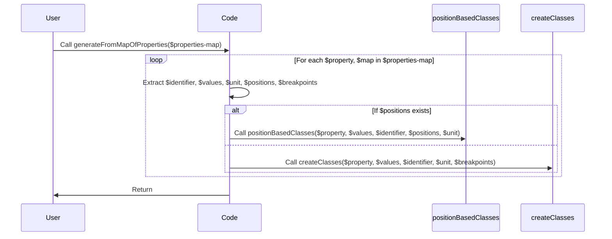

<p align="center"><a href="https://naykel.com.au" target="_blank"></a></p>

# NAYKEL JTB

Why!

> Because without reinventing the wheel we wouldn’t have fast cars.
> -- Nathan Watts


## Creating lists and maps

```scss
$space-base-variants: ( 0: 0, xs: 0.75, sm: 1, base: 1.5, lg: 2, xl: 3 ) !default;
$space-rem-sizes: (0.25, 0.5, 0.75, 1, 1.25, 1.5, 1.75, 2) !default;

$space-base-variants: map-merge($space-base-variants, $space-rem-sizes);
```

---

- values can be a mix of single values and key-value pairs (maps)
  as long at the map is wrapped in parentheses
- map key is the css property
- if the item prefix is omitted the key is used as the prefix

```scss
$examples-map: (
    color: (
        prefix: "txt-",
        values: (green, (blue: blue)),
        breakpoints: ("sm", "md", "lg", "xl")
    ),
    font-style: (
        prefix: "txt-",
        values: ( italic, normal )
    )
);

@include generateFromMapOfProperties($examples-map);
```


```scss
$grid-classes-map: (
    // identifier: (
    //     props: (property: value, property: value),
    //     breakpoints: ("sm", "md", "lg", "xl"),
    //     values: (value, (key: value))
    // ),
    gap: (
        props: (gap: $gap),
        breakpoints: ("sm", "md", "lg", "xl")
    ),
    grid: (
        props: (display: grid, gap: $gap),
        breakpoints: ("sm", "md", "lg", "xl")
    ),
);
```


```scss
$classes-map: (
    class: (
        props: (property: value, property: value),
        breakpoints: ("sm", "md", "lg", "xl")
    ),
);
```
```scss
$property-map: (
    property: (
        values: (value, (key: value))
    ),
);
```



